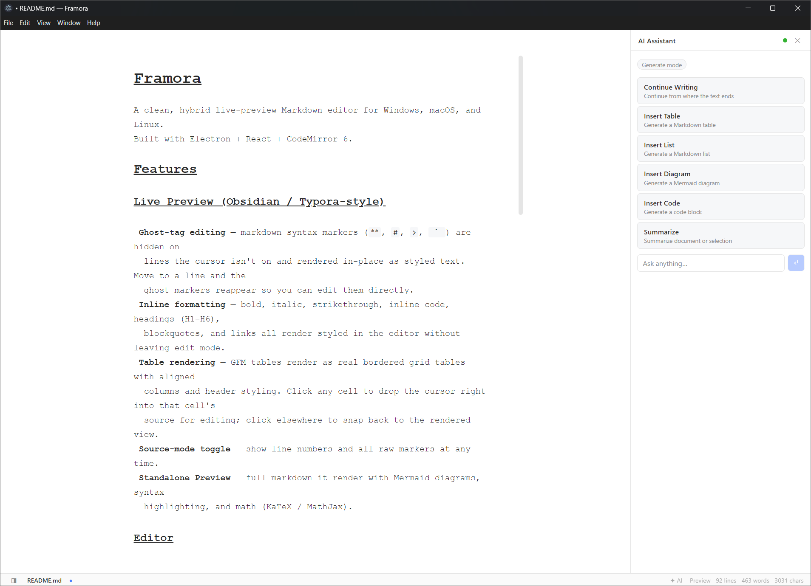
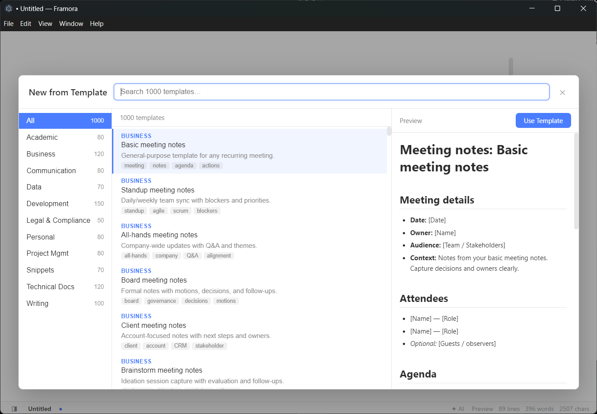

# Framora

A clean, hybrid live-preview Markdown editor for Windows, macOS, and Linux.
Built with Electron + React + CodeMirror 6.





## Features

### Live Preview (Obsidian / Typora-style)

- **Ghost-tag editing** — markdown syntax markers (`**`, `#`, `>`, `` ` ``) are hidden on
  lines the cursor isn't on and rendered in-place as styled text. Move to a line and the
  ghost markers reappear so you can edit them directly.
- **Inline formatting** — bold, italic, strikethrough, inline code, headings (H1–H6),
  blockquotes, and links all render styled in the editor without leaving edit mode.
- **Table rendering** — GFM tables render as real bordered grid tables with aligned
  columns and header styling. Click any cell to drop the cursor right into that cell's
  source for editing; click elsewhere to snap back to the rendered view.
- **Source-mode toggle** — show line numbers and all raw markers at any time.
- **Standalone Preview** — full markdown-it render with Mermaid diagrams, syntax
  highlighting, and math (KaTeX / MathJax).

### AI Assistant (100 % local — no cloud, no API key)

Framora ships a built-in AI writing assistant powered by [dlgo](https://github.com/computerex/dlgo),
a lightweight local LLM inference server. Everything runs on your machine: no data ever leaves
your device.

**Setup:** drop a GGUF model file anywhere on disk, point Framora to it in Settings → AI, and
the assistant becomes available. GPU acceleration (Vulkan) is used automatically when available;
falls back to CPU.

**AI Panel** (click the ✦ AI button or press the shortcut):

| Mode | What it does |
|---|---|
| **Continue Writing** | Generates the next paragraph from the last few lines of context |
| **Insert Table** | Builds a GFM table for the topic at the cursor |
| **Insert List** | Generates a bulleted or numbered list |
| **Insert Diagram** | Writes a Mermaid diagram block |
| **Insert Code** | Generates a fenced code block |
| **Summarize** | Summarizes the full document or selection |
| **Fix Grammar** | Corrects spelling & grammar in the selected text |
| **Improve Writing** | Rewrites selection for clarity and flow |
| **Make Concise** | Shortens the selection without losing meaning |
| **Change Tone** | Adjusts the tone of selected text (formal, casual, etc.) |
| **Remove Secrets** | Strips API keys, tokens, and hex strings from selected text |
| **Ask anything** | Free-form chat prompt with full document context awareness |

Edit tasks show a **before / after diff** so you can review changes before applying them.
Generate tasks stream tokens in real time and can be aborted at any time.

Context is always minimal and surgical — headings, current section, and cursor position are
sent rather than the whole document, so even small local models perform well.

### Editor

- CodeMirror 6 with full keyboard navigation
- Focus mode (dim non-active lines)
- Word / char / line count in status bar
- Light / dark theme that follows the OS

### Template Library (1 000 templates)

Framora ships 1 000 ready-to-use Markdown templates across 11 categories — open the template
picker from **File → New from Template** (or the welcome screen) to browse, search, and preview
before inserting.

| Category | Count |
|---|---|
| Academic | 80 |
| Business | 120 |
| Communication | 80 |
| Data | 70 |
| Development | 150 |
| Legal & Compliance | 50 |
| Personal | 80 |
| Project Management | 80 |
| Snippets | 70 |
| Technical Docs | 120 |
| Writing | 100 |

### File handling

- Open / Save / Save As `.md` files
- File associations for `.md`, `.markdown`, `.mdown`, `.mkd`, `.mkdn`, `.qmd`
  — double-clicking these opens them in Framora once installed
- Recent files (persisted across sessions)
- Welcome screen with recents

### Shell

- Native Electron app, single-instance
- Native menubar (File / Edit / View / Window / Help)
- Status bar (filename, dirty marker, words, chars, lines)

## Dev

```bash
cd framora
npm install
npm run dev
```

The app boots on the first available port and opens an Electron window.
Hot-reload is on for the renderer; main-process changes need a restart.

## Build installers

```bash
npm run package          # auto-detects current platform
npm run package:win      # NSIS .exe (x64/arm64/ia32) + portable .exe
npm run package:mac      # .dmg + .zip (universal)
npm run package:linux    # .AppImage + .deb + .tar.gz
```

Outputs go to `dist/`.

### Code signing

- **macOS**: set `CSC_LINK` + `CSC_KEY_PASSWORD` env vars (your `.p12`),
  and `APPLE_ID` / `APPLE_APP_SPECIFIC_PASSWORD` / `APPLE_TEAM_ID` for notarization.
- **Windows**: set `CSC_LINK` + `CSC_KEY_PASSWORD`, or use Azure Trusted Signing
  via `electron-builder`'s `azureSignOptions`.
- **Linux**: no signing needed; AppImage / .deb just work.

### Icons

Drop your original artwork in `resources/`:
```
resources/icon.icns        macOS
resources/icon.ico         Windows
resources/icons/*.png      Linux  (16/32/48/64/128/256/512)
```

## Roadmap

- **M2** — Mermaid diagrams in live preview, math (KaTeX), code-fence syntax highlighting
  via Shiki, image rendering
- **M3** — File-tree sidebar, global search, exports (PDF / HTML / docx / epub via
  bundled Pandoc), themes engine
- **M4** — Auto-update, command palette, vim keybindings, plugin API

## License

MIT