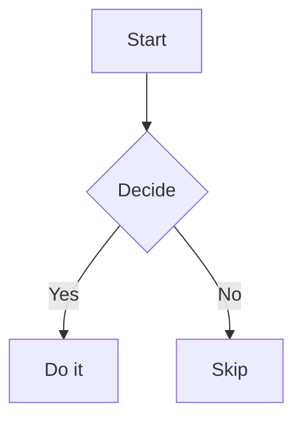

# Hello Framora

This is a **sample** Markdown document used by the E2E suite.

## Features

- Lists
- *Italics* and **bold**
- `inline code`
- [Links](https://example.com)

## Code

```js
const greet = (name) => `Hello, ${name}!`;
console.log(greet('Framora'));
```

## Math

Inline: $E = mc^2$

Block:

$$
\int_0^\infty e^{-x^2}\,dx = \frac{\sqrt{\pi}}{2}
$$

## Table

| Item | Qty | Price |
|------|----:|------:|
| A    |   1 | $1.00 |
| B    |   2 | $4.00 |

## Alert

> [!NOTE]
> This is a note alert.

## Mermaid

