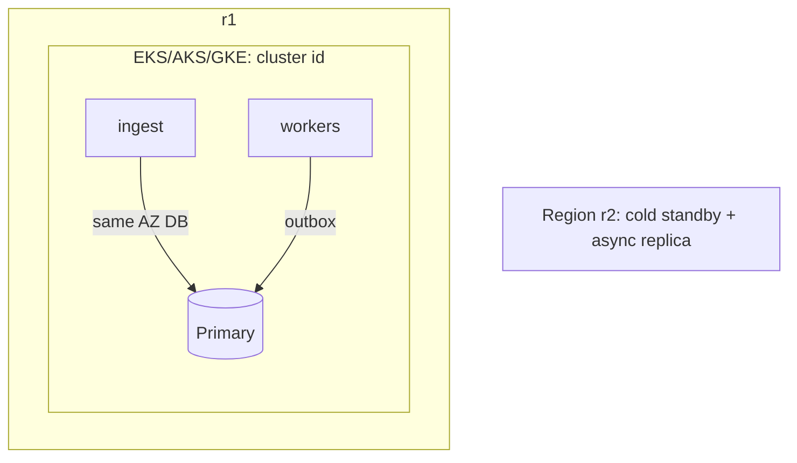

# Deployment view — [Service]

> **Environments* *[`[dev* */* *stage* */* *prod`]*  *—* *prod* *is* *[`[N]* *active* *[`[cell`]*s*  *in* *[`[regions* *A,B`]:**  *—* *one* *chart* *per* *cluster* *owner* in *[`[Grafana* *folder* *…`]*  *

| Cell | What runs | Scaled by | Draining |
| --- | --- | --- | --- |
| `[c1`]*  | *[`[stateless* *API* *+ *worker* *pool* *A`]*  | *HPA* *on* *[`[CPU* *+` *RPS* *from* *ingress*  | *Set* *[`[drain* *=true` in* *[`[cell* *configmap`]*  *—* *wait* *for* *[`[queue* *depth* *0` for* *[T]*  |

## Data placement
- **Primary* *in* *[`[region* *with* *largest* *write* *share`]*  *—* *read* *replica* *in* *[`[region* *B`]*  *for* *[`[dashboard* *readers* *only`]*  *—* *lag* *SLO* *[`[N]* *s* *max* *—* *alert* *in* *[`[panel* *…`]*  *

## Deploy mechanics
- *Helm* *release* *[`[chart* *1.2` —* *values* *per* *cell* *in* *git* *path* *[`[cells/…/values.yaml` —* *Argo* *sync* *policy* *[`[manual* *vs* *auto`]:**  *—* *per* *[`[RTO* *RPO` in* *cell* *runbook* *—* *see* *[`[diaster* *recovery` if* *regional* *outage* *playbook* *required*]**
