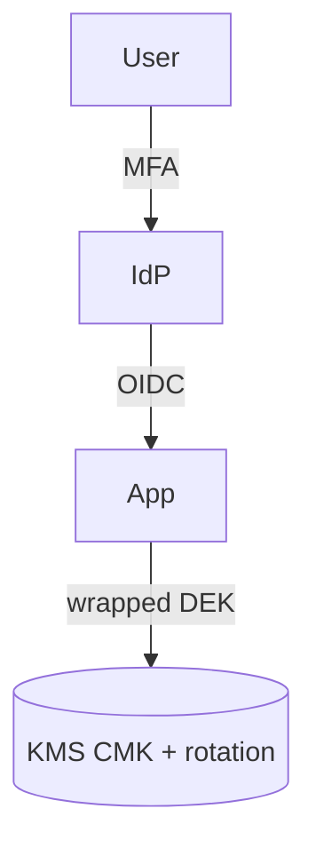

# Security architecture

> **StrIDE* *light* *—* *STRIDE* *full* *in* *[`[threat* *model* *repo* *link* */* *LUCRA` *if* *customer* *shared*]**

| Threat | Mitigation (design) | Evidence |
| --- | --- | --- |
| *Spoofing* *IdP* *users* | *OIDC* *+ *SSO* *only* *—* *[`[cert* *pin* *in* *[mobile]* */* *[`[JWKS* *cache* *TTL* *+` *kid* *rotation* *tests* in *CI*  | *[`[pen* *test* *section* *2.1* */* *zap* *report* *…`]*  |
| *Tampering* *—* *webhook* *body*  | *HMAC* *with* *[`[whsec* *+` *rolling* *keys*  | *Unit* *+* *[replay* *tests* *—* *[`[signature* *verify* *property* *test`]*  |
| *Info* *disclosure* *—* *logs*  | *Redaction* *pipeline* *—* *[`[pii* *fields* *list* *in* *schema`]*  *—* *access* *to* *raw* *logs* *role* *[`[L4* *oncall* *only` *with* *break* *glass*] |

## Dependency chain
- *Uptime* *of* *[`[KMS* */* *IdP* */* *CA` *—* *see* *[`[vendor* *SLA* *links* */* *SCD` in* *BCP*]**

## Exceptions
- *[`[legacy* *endpoint* *without* *auth` *—* *kill* *date* *[`[YYYY* *-* *MM` *—* *compensating* *[`[IP* *allowlist* *+` *WAF* *rate* *limit* *only* *until* *then*]**
