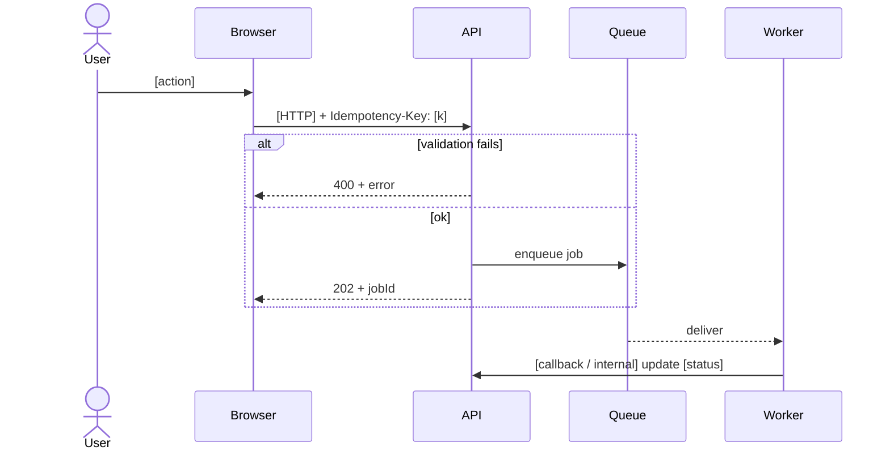

# Sequence: [User journey name]

> **ID:** *[`[SEQ-00`]*  *—* *related* *APIs* *[`[GET* */* *POST* *links`]*  *—* *idempotency* *key* *on* *side* *effects* *where* *marked* *

| Step | Invariant / timeout | Compensating action |
| --- | --- | --- |
| *Enqueue* | *must* *be* *[`[at-least-once`,* *de-dupe* *by* *[`[job* *id`]*  | *Re-process* *safe* *or* *mark* *[`[dead* *letter`]*  |
| *User* *notification* *email* *—* *best-effort* *—* *if* *[`[SMTP* *down`]*  *N* *times*  | *Retry* *with* *[`[exponential* *backoff` + *in-app* *banner* *fallback*  |

## Failure note
- *If* *[`[clock* *skew`]*  *—* *JWT* *[`[nbf`]*  *fails* *—* *see* *troubleshoot* *auth* *—* *not* *shown* *as* *alt* *block* *if* *rare* *—* *link* *instead* *—* *[`[FAQ`]*  *
