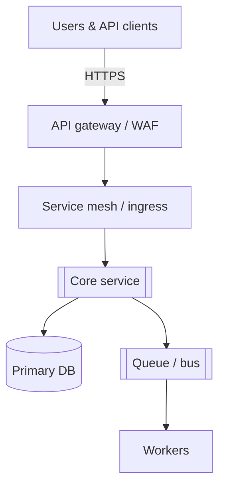

# System overview — [Product]

> **Audience:** *new* *engineers* *and* *security* *reviewers* — *not* *a* *deployment* *runbook* *—* *see* *[deployment* *for* *hosts]*

## Subsystems
| Subsystem | Responsibility | SLO (summary) | Owner |
| --- | --- | --- | --- |
| **`[ingest`]** | *Accept* *writes* *—* *validate* *schema* *—* *emit* *events* *—* *[`[p99* *<`]* | *[team]* |
| **`[index`]** | *Search* *index* *rebuild* *—* *[`[freshness* *<]* | *[team]* |
| **`[notifier`]** | *Push* *emails* *+* *webhooks* *—* *at-least-once* *delivery* *—* *[`[retry* *policy`]*  | *[team]* |

## Trust boundaries
- **Unauthenticated* *to* *[`[gateway`]* *—* *only* *public* *routes* *[`[list* *in* *OAS`]*  *
- **Service-to-service* *—* *[`[mTLS* *+` *SPIFFE* *IDs* *—* *no* *lateral* *movement* *without* *[`[policy* *X`]*  *

## Non-goals (this doc)
- *Per-table* *schema* *—* *use* *[`[data* *dictionary* *doc`]*  *—* *sequence* *details* *—* *see* *[`[sequence* *diagram* *doc`]*  *
