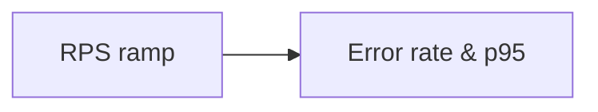

# Benchmark: Throughput (saturation)

> **Target* *—* *find* *[`[knee* *of* *the* *curve`] —* *not* *a* *bragging* *number*]**



| Phase | RPS | Duration | What we record |
| --- | --- | --- | --- |
| *1*  | *0* *- >* *[`[A`]*  | *5* *min*  | *p95* *per* *step*  |
| *2*  | *hold* *[`[A`]*  | *30* *min*  | *CPU* *+ *throttle* *events*  |

- *Sustain* *[`[A` RPS* *with* *[`[E* *%* *errors* *<`]*  *0.1%* *—* *document* *bottleneck* *[`[DB* *CPU* */* *pool* *…`]**

```text
# Example observation
Bottleneck: DB connections at 80% pool; before CPU saturated
```

## Compare runs
- *Table* *—* *[`[before* *tuning* *vs* *after* *index* */* *cache`] —* *date* *+` *git* *sha*  *
