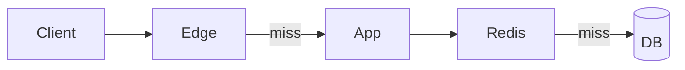

# Compare: Caching strategies

> **Scenarios* *—* *[`[public* *assets* *vs* *auth* *API* *read* *vs* *write* *behind* *…`]*  *—* *pick* *one* *row* *per* *slice*]**

| Strategy | Best for | Cons | Staleness | Ops burden |
| --- | --- | --- | --- | --- |
| **CDN* *edge*  | *Static* *+ *immut* *path*  | *Not* *for* *private* *HTML*  | *Minutes* *–* *days*  | *Low*  |
| **Redis* *shared*  | *Per-key* *hot* *objects*  | *Network* *hop*  | *Seconds*  | *Med*  |
| **In-process* *LRU*  | *Config* *read* *many* *times*  | *No* *cross-node*  | *ms*  | *Low*  |
| **Write-through* *DB*  | *Read-your-writes*  | *Slower* *writes*  | *—*  | *High*  |

## Decision tree (short)
- *If* *cacheable* *and* *public* *and* *immutable* *URL* *—* *[`[CDN`] first*  |
- *If* *per* *user* *or* *tenant* *—* *[`[Redis* *+ key* *with* *tenant* *id`] not* *CDN*  |
- *If* *stampede* *risk* *—* *add* *[`[singleflight* */* *request* *coalescing`]**

## When not to
- *Strong* *read-after-write* *consistency* *for* *money* *—* *skip* *cache* *on* *hot* *path* *or* *use* *very* *short* *TTL* *+` *ver* *field*  |
