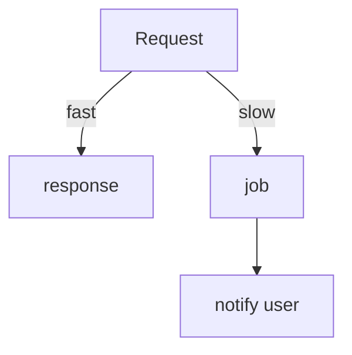

# Compare: Sync vs async in APIs

> **User-facing* *SLA* *drives* *this* *—* *if* *[`[>2s* *p95` for* *human* *—* *usually* *async* *job*]**

| Pattern | UX | Complex parts | When |
| --- | --- | --- | --- |
| *Sync* *HTTP*  | *Simple*  | *Timeouts* *—* *cascades*  | *[`[<500ms* *back-end* *work`]*  |
| *202* *+* *poll*  | *OK*  | *State* *machine*  | *[`[seconds* *–* *minutes`]*  |
| *Webhooks*  | *N/A*  | *Delivery* *+` *verify*  | *Partner* *integrations*  |
| *Streams*  | *Live*  | *Backpressure*  | *Events* *+` *huge* *volume*  |

## Pitfalls
- *Polling* *too* *fast* *—* *[`[429* *client* *DDoS* *yourself` —* *exponential* *backoff*  |
- *Idempotency* *on* *job* *creation* *—* *[`[POST* *with* *Idempotency* *-Key`] required*]**
