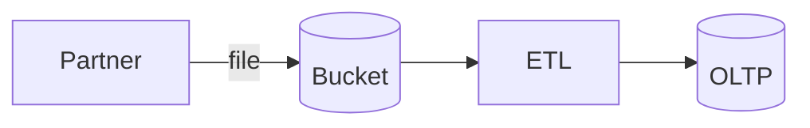

# Integration patterns catalog

> *Pick* *a* *row* *per* *connector* *—* *document* *in* *[`[connector* *spec* *per* *partner* */* *…`]*]**

| Pattern | When | At-least/Exactly once | Our components |
| --- | --- | --- | --- |
| *Real-time* *webhook*  | *Partner* *pushes*  | *at-least*  | *HMAC* *verify*  |
| *Scheduled* *poll*  | *No* *webhooks*  | *at-least*  | *idempotent* *upsert*  |
| *S3* *file* *drop*  | *Batch*  | *exactly* *once* *per* *file*  | *ETL* *job*  |
| *Reverse* *ETL*  | *Data* *warehouse* *→* *app*  | *nightly*  | *outbox*  |

## Partner checklist
- *[`[test* *sandbox* *endpoints* */* *prod* *allowlist* *IPs* */* *rate* *limits* */* *contact* *oncall* */* *…`] —* *link* *to* *[`[vendor* *status* *page`]:**  *
