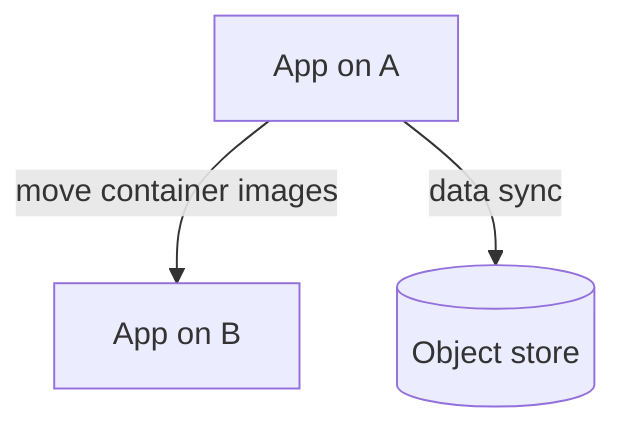

# Cloud provider migration: [A] → [B]

> *Drivers:* *[`[cost* */* *data* *residency* */* *feature* *parity`]*  *—* *freeze* *new* *dependencies* *on* *A-specific* *services* *not* *available* *on* *B* *or* *replace* *with* *[`[abstraction* *layer* *M`]*  *

## Dependency map
| Current (A) | Target (B) | Migration approach |
| --- | --- | --- |
| *[`[S3`]*  | *[`[GCS* *or* *Blob`]*  | *rclone* */* *native* *transfer* *job* *with* *CRC* *compare* *—* *see* *[`[bytes* *transferred* *dashboard`]*  *
| *[`[RDS* *+* *Aurora`]*  | *[`[Spanner* *or* *Cloud* *SQL`]*  | *DMS* */ *`[import* *via* *dump` —* *cutover* *as* in *[`[DB* *migration* *doc`]*  *

## Network
- *VPN* *or* *PrivateLink* *peering* *during* *sync* *—* *tight* *NACL* *to* *[`[ops* *CIDR* *only`]*  *

## DNS & TLS
- *Lower* *[`[TTL* *to* *60`]*  *3* *days* *before* *—* *validate* *cert* *on* *B* *in* *[`[staging* *name`]*  *—* *flip* *CNAME* *at* *[`[T0`]*  *

## Exit checklist
- [ ] *Decommission* *A* *backups* *per* *[`[retention* *policy* *exception`]*  *approved* *by* *[`[legal`]*  *
- [ ] *Remove* *A* *IAM* *roles* *—* *prove* *no* *cross* *cloud* *egress* *in* *[`[NPM* *cost* *view`]*  *
