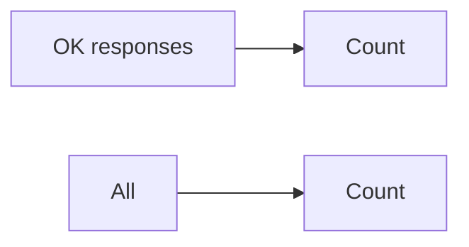

# Spec: Availability SLO

> **Service* *name* *[`[SVC`] —* *users* *[`[internal* *+` *externally* *facing* */* *…` —* *owner* *[`[team* *+` *oncall* *rot*]**

| Field | Value |
| --- | --- |
| **Objective**  | *[`[99.9%* *of* *OK* *responses* *per* *month* */* *excluding* *[`[vendor* *A` outage`]*] |
| *Measurement*  | *HTTP* *2xx* *+` *3xx* *excluding* *[`[404* *if* *idempotent* *GET`]*  *on* *[`[ingress* *metric* *label* *=…`]*  |
| *Exclusions*  | *Planned* *maintenance* *in* *[`[status* *page* *as* *[window]`] —* *client* *errors* *4xx*  |
| *Error* *budget*  | *43.2* *min* *-`* *month* *at* *99.9%*  *—* *burn* *alerts* *[`[see* *panel`]*  |

## Policy when budget is burned
- *Freeze* *non-essential* *deploys* *—* *[`[except* *P0* *sev* *fix`] —* *triage* *in* *[`[weekly* *reliability* *meeting* */* *link`] —* *postmortem* *if* *[`[root* *cause* *in* *our* *control`]**
