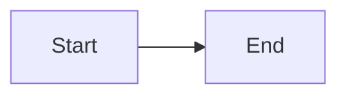

# Style: Code and diagrams

> *Samples* *must* *compile* *or* *run* *in* *[`[documented* *version* */* *docker* *image* */* *…`] —* *mark* *pseudocode* *explicitly*]**

```ts
// Good: file path in comment, realistic names
// examples/auth/login.test.ts
import { [Thing] } from "[package]";
```

| Element | Rule |
| --- | --- |
| *Fences*  | *Language* *tag* *required* *—* *no* *huge* *blocks* *—* *link* *to* *repo* *for* *long*  |
| *Line* *length*  | *~* *80* *in* *prose* *—* *wider* *ok* in *code*  |
| *Mermaid*  | *version* *pin* *if* *using* *new* *syntax* *—* *test* in *CI* *or* *preview*  |

- *Avoid* *[`[real* *passwords* */* *tokens* */* *customer* *domains`] —* *use* *[`[…`]* *or* *[`[example* *.com* */* *…`]**



## Screenshots
- *Narrow* *to* *relevant* *—* *annotate* *with* *numbers* *referencing* *steps*  |
