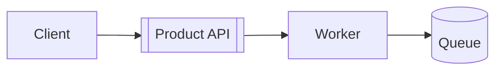

# Tutorial — Intermediate: [System slice]

> **Prereq:** [beginner tutorial] *or* [6 months] using [Product]. **Outcome:** A working [integration slice].

## Scope & constraints
- You **must** use `[v2 API]` — *no* [legacy] endpoints
- **Data:** **do not** use real customer PII — *use* the provided **[fixture org]**
- **SLA to yourself:** [finish] within **[timebox]** — *pause* at checkpoints

## Architecture snapshot

*Explain in words:* [1 paragraph tying boxes to *your* task]

## Exercise
### Step A — [Name]
- Implement [A1], [A2] — *assert* with **[test ID / log line]**
### Step B — [Name] — *failure mode*
- Intentionally trigger **[error case]** then **recover** using **[doc link]**
### Step C — [Name] — *observability*
- Add [metric/log/trace] — view in [observability UI] — *capture* screenshot [not required] / **paste** request id

## Rubric (self-check)
| Criterion | Pass |
| --- | --- |
| Idempotent re-run | [no dupes] |
| Auth | [uses least scope] |
| Timeouts & retries | [backoff] visible |
| [Check 4] | [result] |

## Solution & diff
- **Branch/tag:** [reference] — *compare* *only after* you attempt — *spoiler* policy: [on honor]

## Extension (optional)
- [Harder] — [1 paragraph]
